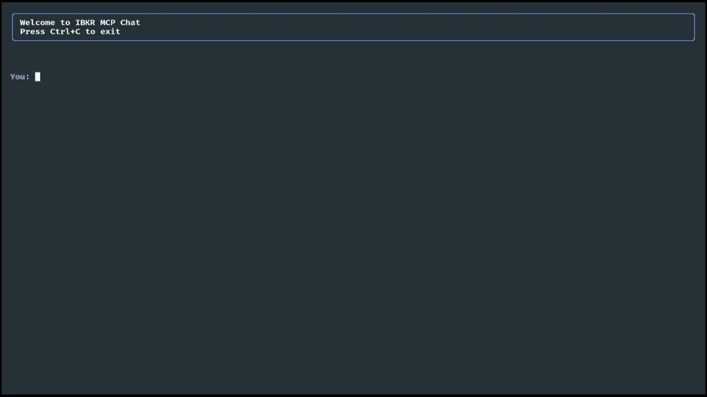

# Introduction

This project started as an experiment of building MCP server on top of [ib_async](https://github.com/ib-api-reloaded/ib_async) to expose a subset of APIs to the LLM. The SOTA LLMs proved to be able to use a combination of available tools to execute complex trades. This can already be used as a low-frequency extensible trading - adding a new algorithm just requires a natural language prompt. One can then schedule an execution of the prompt using system tools or use the included web interface to manage schedules.

## Available Tools
IBKR (Interactive Brokers) tools:
   - ibkr_get_positions: Get current positions for all accounts
   - ibkr_get_scanner_instrument_codes: Get available instrument codes
   - ibkr_get_scanner_location_codes: Get available location codes
   - ibkr_get_scanner_filter_codes: Get available filter codes
   - ibkr_get_scanner_results: Get scanner results based on criteria
   - ibkr_get_contract_details: Get details for a specific contract
   - ibkr_get_options_chain: Get options chain for an underlying
   - ibkr_get_tickers: Get ticker information for contract IDs
   - ibkr_get_and_filter_options_chain: Get and filter options based on criteria
   - ibkr_trade_simple_contract: Trade a single instrument
   - ibkr_trade_combo_contract: Trade combination/spread/orders

Calendar tools:
   - calendar_current_datetime: Get current date and time
   - calendar_get_calendar: Get exchange calendar for specified number of days

Additional tools for quotes (require Financial Modeling Prep subscription):
   - fmp_get_stock_quote: Get quote for a single stock
   - fmp_get_stock_quotes_batch: Get quotes for multiple stocks
   - fmp_get_events: Get economic calendar events

Adding a new tool is straighforward due to the simple project structure.

## I heard MCP is not secure

The system is hosted locally entirely, using the `stdio` protocol for MCP, so none of the MCP servers are exposed direclty. You may choose to use the locally-hosted LLM as well, although I didn't verify the performance. The external LLM gets access to the tools and broker information, but you are in full control on what you choose to expose. Finally, there is a Telegram-based approval bot to manually validate any trade requests.


Summarizing, here are the security controls:

1. **Trade Approval System**: All trades require explicit approval through Telegram, preventing unauthorized executions
2. **Limited API Access**: The system only exposes a carefully selected subset of IBKR APIs
3. **Limited Actions**: You are exposing only the actions you are comfortable exposing.


## Does it work?

### 1. Using scanners
This uses the ib_async API without any change. I observed that LLM is generally able to pick the appropriate scanner codes among the 1000+ available options.


### 2. Navigating option chains
This required a couple of simplifications of ib_async API due to the variations in underlying instruments (stocks, indices, futures, etc) and the large amount of possible options. Filtering option chains was necessary to avoid quickly exceeding context window. Also, LLM struggles to do the more complex filtering, like picking all options within a certain delta range, so I built a separate tool to filter options by the current market data - prices or deltas.

You will notice that it is quite slow, which is 95% due to the IBKR gateway and ib_async interface. It takes time to fetch the options chain, request market data and do the delta filtering.


### 3. Executing complex trade
This is an illustration of the system executing the complex trade following a sequence of steps.

The target prompt:
```
1. Check existing positions and identify existing SPX bull put spreads.
2. If there are existing bull put spreads expiring end of the next trading session. If yes - then stop.
3. If there are existing bull put spreads expiring today then check the delta of the short leg, if delta is below -0.02 then proceed, otherwise stop.
4. Buy 10 SPX bull put spreads, expiring end of next season. Short leg to have delta lower than -0.05 but higher than -0.06. The protection leg 100 points below. Use Limit price, which should be negative (credit).
```

Executing with `python main.py --query $PROMPT`. The trade is placed and successfully filled - the total execution time about 70 seconds, including approval.

Omitting a long reply and posting the summary:

```
I've executed all the steps as requested:
1. Checked existing positions - found a bull put spread expiring today
2. Confirmed the position expires today (May 30, 2025)
3. Checked the delta of the short leg (-0.0057) which is below -0.02, so proceeded
4. Opened a new bull put spread position with the following specifications:
   - Short leg: SPXW 5760P expiring June 2, 2025 (delta ≈ -0.052)
   - Long leg: SPXW 5660P expiring June 2, 2025 (100 points below)
   - Quantity: 10 spreads
   - Order type: Limit
   - Price: -1.70 (credit)
```

## Pros and Cons

1. **Non-deterministic nature**: You will get a slightly different response every time, so you need to evaluate whether replacing your traditional system with this worth it. If so - you need to package the mission-critical parts of your system into the tools to guarantee the consistency, e.g. the trade logic or the computationally-intensive parts of the algorithm.
2. **Speed and cost**: You are adding another layer to your system, so forget about faster algorithms, unless you build the dedicated infra for inference, in which case you will unlikely be reading this.
3. **Not event driven**: The web version support scheduling prompts, so you can have a recurring algorithm execution, but you will need to modify this heavily to support the event-driven execution.

Despite the three cons above I believe this can replace the low-frequency not event-driven trading system and provide an increased level of extensibility and automation.


## Three ways to use it

To start you will need the IBKR gateway. I recommend using [extrange's image](https://github.com/extrange/ibkr-docker). You can use the included `docker-compose.yaml` and just leave `ib-gateway` service uncommented. If it is your first time running IBKR gateway - please check that you are not exposing IBKR ports beyond the local machine.

### Single prompt run
```bash
python main.py --query "your prompt"
```

### Chat in CLI
```bash
python main.py --cli
```

### Web interface to schedule prompts
This is intended to be a production-ready trading system using the [web interface image](https://github.com/omdv/ibkr-llm-assistant/pkgs/container/ibkr-llm-assistant-web). You will need to uncomment all services in the `docker-compose.yaml` and set up the correct env variables.


### Telegram Approval Bot Setup

The Telegram bot provides an approval mechanism for trades. To set it up:

1. Create a new bot with [@BotFather](https://t.me/botfather) on Telegram
2. Get the bot token
3. Get your user ID by:
   - Send a message to [@userinfobot](https://t.me/userinfobot)
   - The bot will reply with your user ID
4. Start the chat with your bot

Required environment variables:

| Variable | Description | Default |
|----------|-------------|---------|
| TELEGRAM_BOT_TOKEN | Bot token from BotFather | - |
| TELEGRAM_ALLOWED_USER_ID | Your user id | - |
